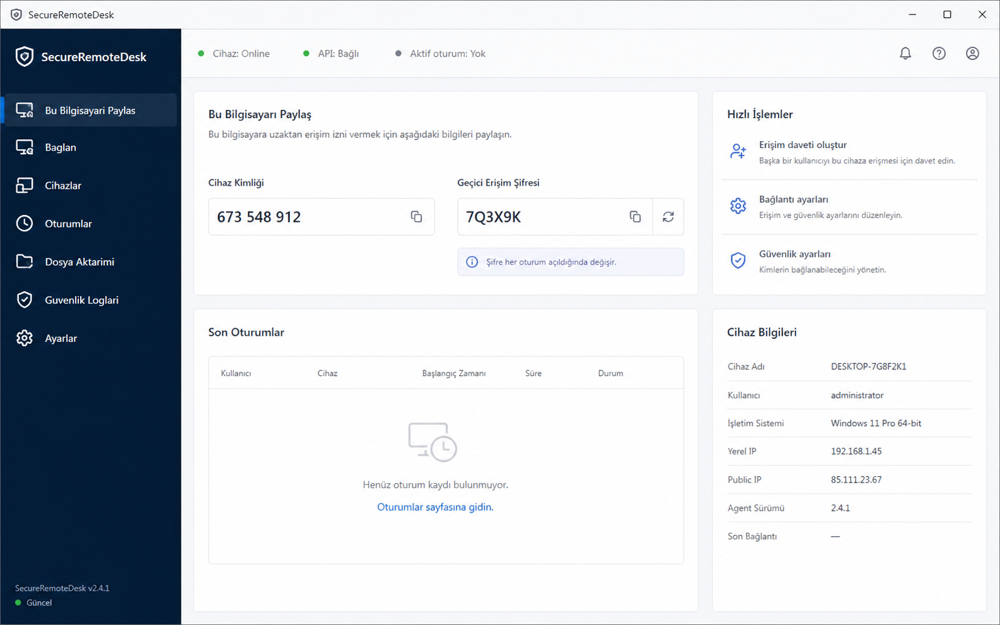
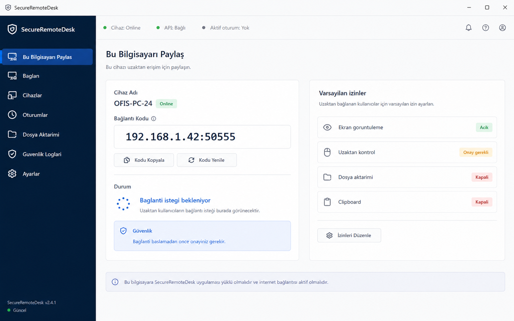
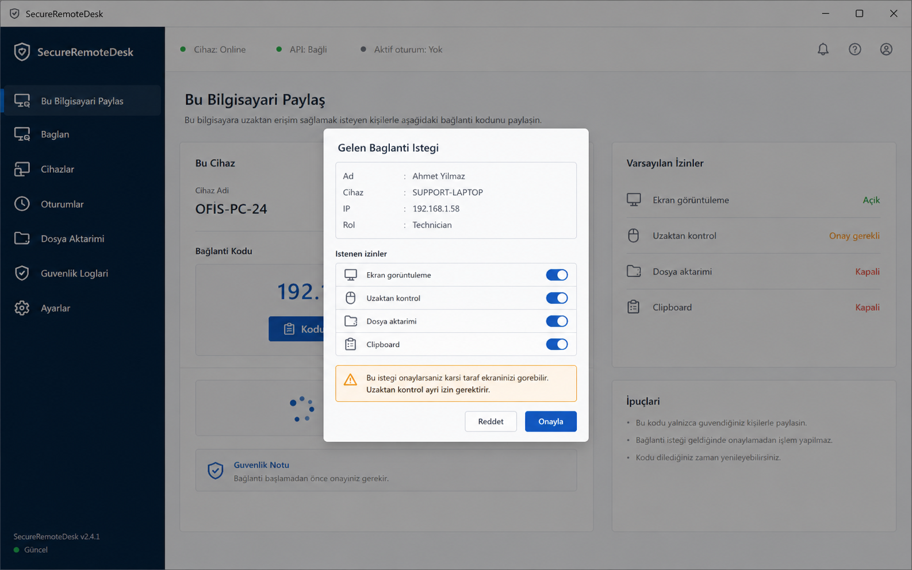
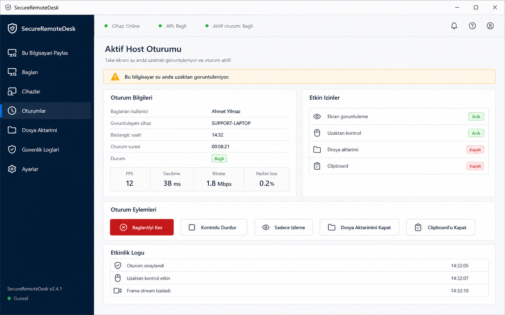
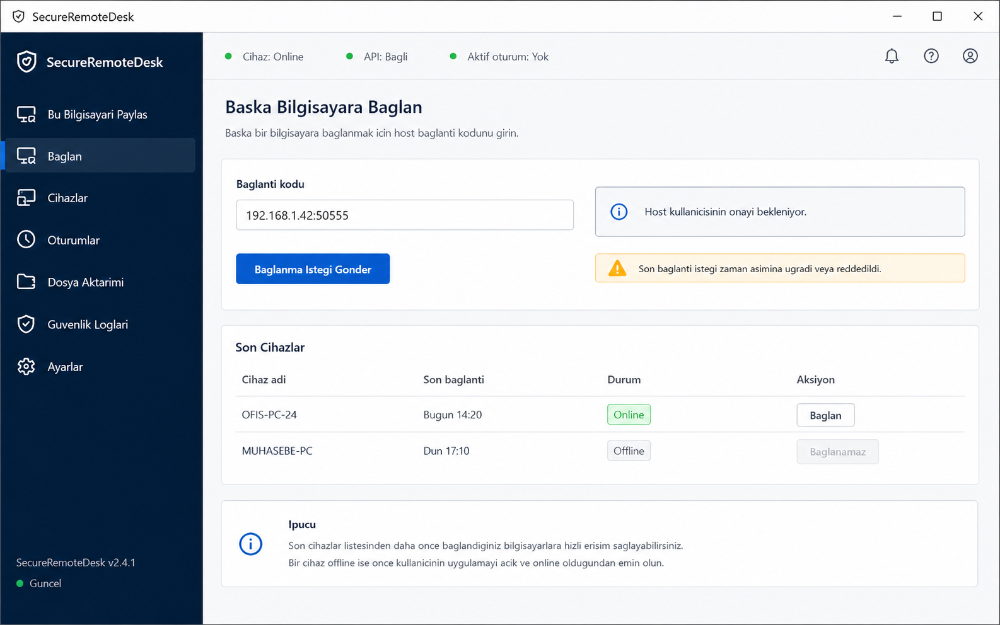
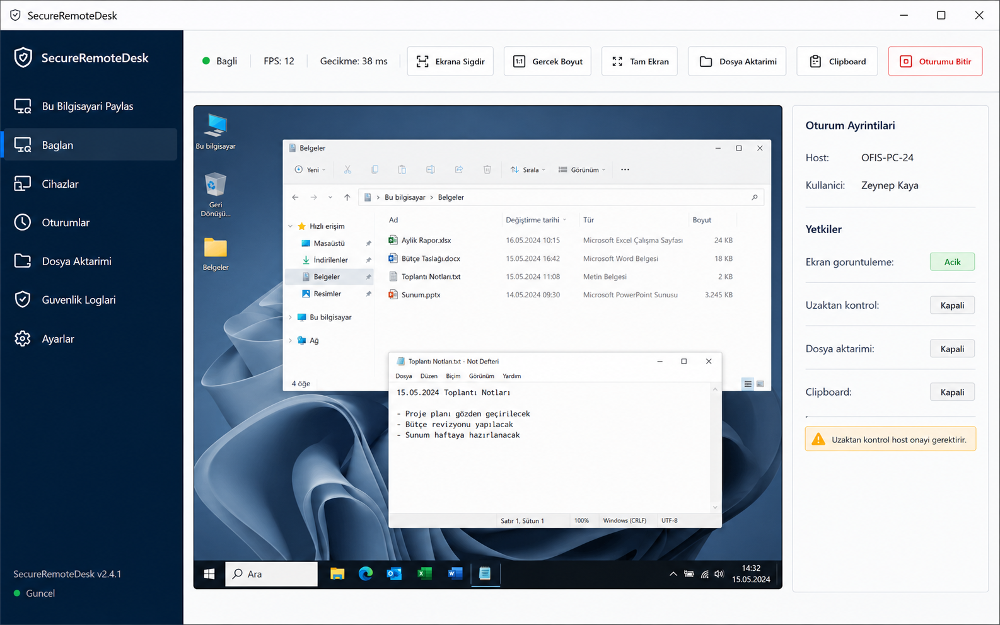
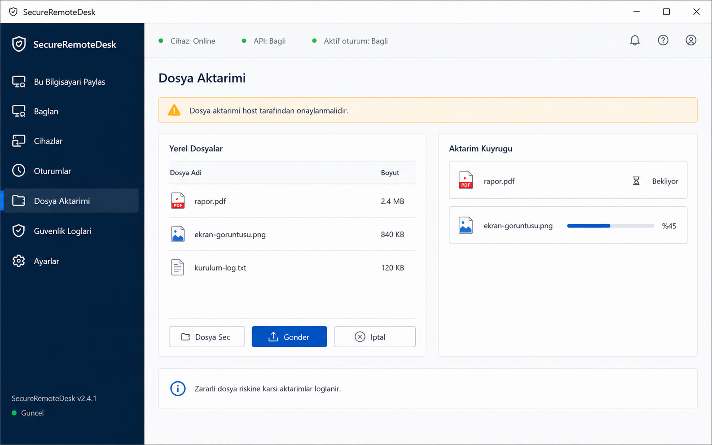
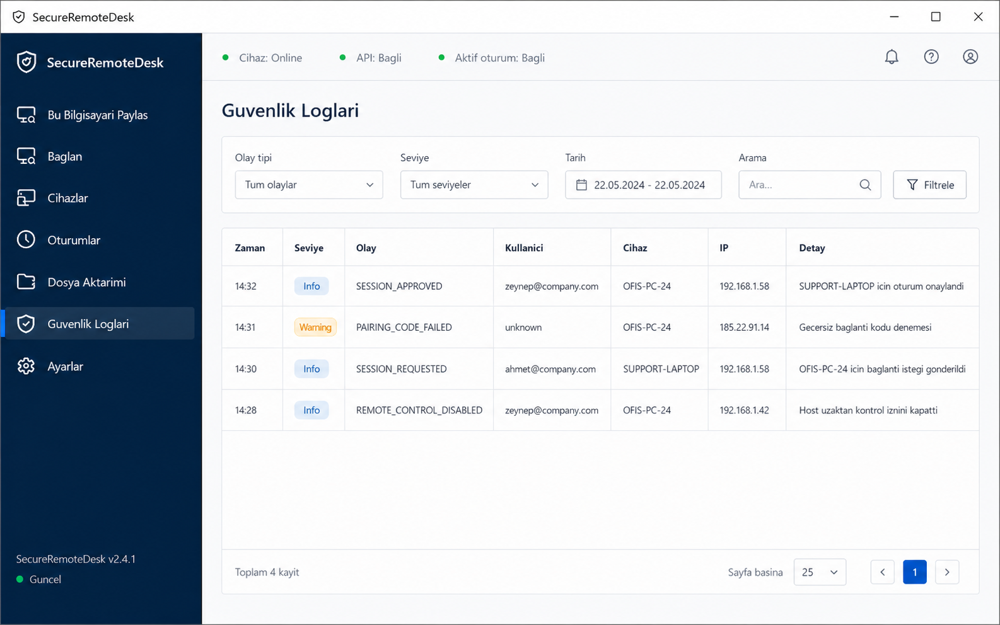
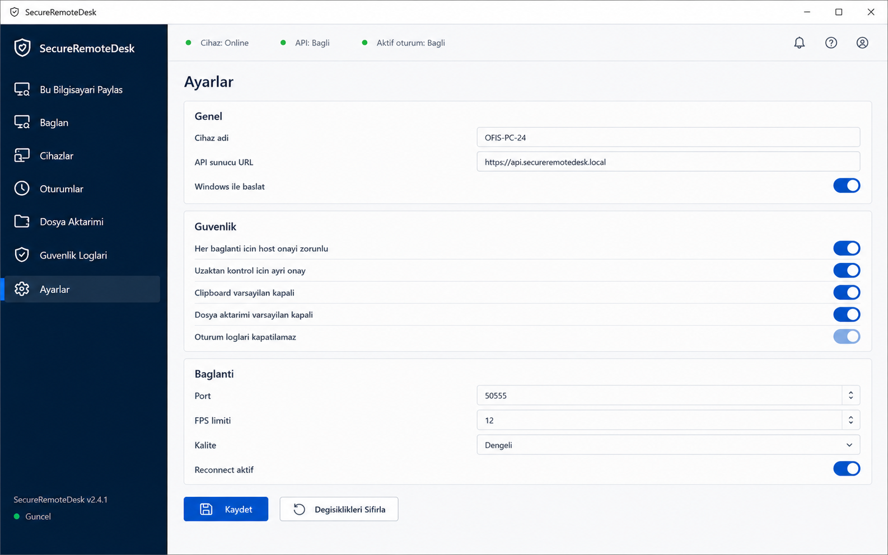
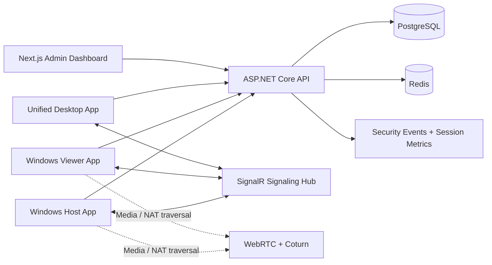

# SecureRemoteDesk

<p align="center">
  <strong>Permission-first remote desktop, support session and device access platform for Windows.</strong>
</p>

<p align="center">
  <a href="#quick-start"></a>
  <a href="#backend-api"></a>
  <a href="#admin-dashboard"></a>
  <a href="#windows-desktop"></a>
  <a href="#security-model"></a>
</p>

<p align="center">
  <a href="#showcase">Showcase</a> |
  <a href="#architecture">Architecture</a> |
  <a href="#quick-start">Quick Start</a> |
  <a href="#api-surface">API</a> |
  <a href="#security-model">Security</a> |
  <a href="#roadmap">Roadmap</a>
</p>



SecureRemoteDesk is a full-stack remote desktop monorepo built around explicit consent, auditable sessions and modular production boundaries. It combines a Windows desktop experience, an ASP.NET Core backend, a Next.js admin dashboard, SignalR signaling, PostgreSQL persistence, Redis-ready infrastructure and Coturn/Nginx deployment assets.

The project is intentionally designed for owned devices, internal IT support and explicitly authorized remote assistance. It does not implement stealth access, hidden execution, backdoor behavior or unattended unauthorized control.

## Highlights

- Permission-first remote sessions with host-side approval before access starts.
- Separate permissions for screen viewing, remote control, file transfer and clipboard.
- WPF Windows clients for Host, Viewer and a unified desktop shell.
- ASP.NET Core 8 API with layered Domain, Application, Infrastructure and API projects.
- JWT authentication, password hashing, refresh-token hashing and audit event writing.
- SignalR hub for session events and WebRTC signaling messages.
- PostgreSQL-backed device, user, session, metric and security-event storage.
- Next.js admin dashboard foundation for operations and monitoring.
- Docker Compose stack with PostgreSQL, Redis, backend API, admin dashboard and Coturn.
- Installer scripts and Inno Setup definitions for Windows distribution.
- Production-oriented docs for architecture, API, deployment, security and QA.

## Showcase

### Host Permission Center

The host can share a device code, review default permissions and keep sensitive capabilities disabled by default.



### Explicit Connection Approval

Every incoming request shows the requester identity, device, IP, role and requested permissions before the host can approve.



### Active Host Session

During an approved session, the host sees session state, metrics, effective permissions, activity logs and immediate shutdown controls.



### Viewer Connection Flow

The viewer enters a connection code, sends a request and waits for host approval. Previously used devices can be listed for faster reconnects.



### Remote Viewer Session

The viewer surface exposes session metrics and scoped tools while reflecting host-approved permission boundaries.



### Approved File Transfer

File transfer is treated as a separately approved capability, with queue visibility and audit-friendly flow.



### Security Audit Log

Security events are visible, searchable and structured for operational review.



### Security Settings

Security defaults keep host approval, remote-control approval, clipboard restrictions and file-transfer restrictions explicit.



## Architecture



### Monorepo Layout

```text
SecureRemoteDesk/
  apps/
    backend-api/          ASP.NET Core 8 API and tests
    admin-dashboard/      Next.js operations dashboard
    host-windows/         Dedicated WPF host client
    viewer-windows/       Dedicated WPF viewer client
    desktop-windows/      Unified Host + Viewer Windows app
  packages/
    shared-protocol/      Signaling message contract
    shared-security/      Security policy notes
    shared-types/         Shared session type definitions
  infra/
    docker/               Dockerfiles for API and dashboard
    coturn/               TURN server configuration
    nginx/                Reverse proxy example
    scripts/              Windows installer build scripts
  installer/              Inno Setup installer definitions
  docs/                   Architecture, API, deployment, security and QA docs
```

## Technology Stack

| Layer | Technology | Purpose |
| --- | --- | --- |
| Backend API | ASP.NET Core 8, C# | REST API, auth, sessions, devices, signaling host |
| Persistence | EF Core, PostgreSQL | Users, devices, sessions, metrics, security events |
| Auth | JWT, hashed refresh tokens | Access control and token lifecycle |
| Realtime | SignalR | Session request/approval and WebRTC signaling relay |
| Windows Clients | WPF, MVVM, .NET 8 | Host, viewer and unified desktop experiences |
| Admin UI | Next.js 16, React, TypeScript, Tailwind | Admin and operations dashboard |
| Infrastructure | Docker Compose, Redis, Coturn, Nginx | Local stack and production building blocks |
| Installers | PowerShell, Inno Setup | Windows setup artifacts |

## Backend API

The backend follows a clean layered structure:

- `SecureRemoteDesk.Domain`: entities and enums.
- `SecureRemoteDesk.Application`: DTOs and use-case services.
- `SecureRemoteDesk.Infrastructure`: EF Core, persistence, security and audit implementations.
- `SecureRemoteDesk.Api`: controllers, middleware, Swagger, health checks and SignalR hub.

Implemented API areas:

- Authentication: register, login, refresh, logout and password reset endpoints.
- Devices: device registration, device listing, pairing-code generation and pairing.
- Sessions: request, approve, reject, start, end and list session flows.
- Admin: overview endpoint foundation for operational dashboards.
- Signaling: `/hubs/signaling` SignalR hub for session and WebRTC messages.

## Windows Desktop

SecureRemoteDesk includes three Windows client surfaces:

- `apps/host-windows`: host-only WPF app focused on device sharing and approval.
- `apps/viewer-windows`: viewer-only WPF app focused on connecting and controlling approved sessions.
- `apps/desktop-windows`: unified desktop app with Host and Viewer modes in one executable.

The client layer is structured with MVVM patterns and service abstractions so production integrations such as `Windows.Graphics.Capture`, WebRTC media tracks and guarded `SendInput` can be added behind stable interfaces.

## Admin Dashboard

The admin dashboard is a Next.js application designed for operational visibility:

- session and device overview foundations,
- security-event visibility,
- API integration via `NEXT_PUBLIC_API_URL`,
- SignalR endpoint configuration via `NEXT_PUBLIC_SIGNALING_URL`,
- Tailwind-based UI structure ready for production dashboard screens.

## Security Model

SecureRemoteDesk is built around explicit, visible and revocable consent.

Required controls:

- Host approval is mandatory for every remote session.
- The host must see active session state while access is running.
- Remote control requires a separate permission from screen viewing.
- File transfer, clipboard and audio are disabled by default.
- Pairing codes are short-lived and stored as hashes.
- Refresh tokens are stored as hashes.
- API access is authenticated with JWT.
- Security events and session activity are written to audit logs.
- Production deployments must use TLS and strong secrets.

Prohibited behavior:

- no stealth mode,
- no hidden access,
- no keylogging,
- no credential harvesting,
- no firewall/antivirus bypass,
- no persistence bypass,
- no unauthorized unattended access.

More detail: [docs/SECURITY.md](docs/SECURITY.md)

## Quick Start

### Requirements

- .NET 8 SDK
- Node.js 22+
- Docker Desktop
- PostgreSQL tools, optional for local database inspection
- Inno Setup, optional for installer builds

### Run the Full Stack with Docker

```powershell
cd SecureRemoteDesk
copy .env.example .env
docker compose up --build
```

Default local services:

| Service | URL |
| --- | --- |
| Admin Dashboard | `http://localhost:3000` |
| Backend API | `http://localhost:8080` |
| Swagger UI | `http://localhost:8080/swagger` |
| SignalR Hub | `http://localhost:8080/hubs/signaling` |
| Health Check | `http://localhost:8080/health` |
| PostgreSQL | `localhost:5432` |
| Redis | `localhost:6379` |
| Coturn | `localhost:3478` |

### Backend Development

```powershell
cd apps/backend-api
dotnet restore
dotnet ef migrations add InitialCreate --project src/SecureRemoteDesk.Infrastructure --startup-project src/SecureRemoteDesk.Api
dotnet ef database update --project src/SecureRemoteDesk.Infrastructure --startup-project src/SecureRemoteDesk.Api
dotnet run --project src/SecureRemoteDesk.Api
```

### Admin Dashboard Development

```powershell
cd apps/admin-dashboard
npm install
npm run dev
```

### Windows Clients

```powershell
dotnet run --project apps/host-windows/src/SecureRemoteDesk.Host.csproj
dotnet run --project apps/viewer-windows/src/SecureRemoteDesk.Viewer.csproj
dotnet run --project apps/desktop-windows/src/SecureRemoteDesk.Desktop.csproj
```

## API Surface

Protected endpoints require:

```http
Authorization: Bearer <access-token>
```

Main routes:

| Area | Endpoints |
| --- | --- |
| Auth | `POST /api/auth/register`, `POST /api/auth/login`, `POST /api/auth/refresh`, `POST /api/auth/logout` |
| Password Reset | `POST /api/auth/password-reset/request`, `POST /api/auth/password-reset/confirm` |
| Devices | `POST /api/devices/register`, `GET /api/devices`, `POST /api/devices/{deviceId}/pairing-code`, `POST /api/devices/pair` |
| Sessions | `POST /api/sessions/request`, `POST /api/sessions/{id}/approve`, `POST /api/sessions/{id}/reject`, `POST /api/sessions/{id}/start`, `POST /api/sessions/{id}/end`, `GET /api/sessions` |
| Admin | `GET /api/admin/overview` |
| Realtime | `GET /hubs/signaling` |

Allowed MVP signaling messages:

- `session.request`
- `session.approve`
- `session.reject`
- `session.end`
- `webrtc.offer`
- `webrtc.answer`
- `webrtc.iceCandidate`

More detail: [docs/API.md](docs/API.md)

## Session Lifecycle

1. Host logs in and registers a trusted device.
2. Host generates a short-lived pairing or connection code.
3. Viewer enters the code and requests a session.
4. Backend stores the request and notifies the host through SignalR.
5. Host reviews requester identity and requested permissions.
6. Host approves or rejects the request.
7. Approved sessions exchange WebRTC offer/answer/ICE messages through the signaling hub.
8. Host can end the session or downgrade permissions at any time.
9. Backend records audit logs and session metrics.

## Testing

Backend tests:

```powershell
dotnet test apps/backend-api/SecureRemoteDesk.Backend.sln
```

Admin checks:

```powershell
cd apps/admin-dashboard
npm run typecheck
npm run lint
npm run build
```

## Windows Installer

Build installer artifacts with:

```powershell
.\infra\scripts\build-windows-installers.ps1
```

Expected output:

```text
artifacts/installers/SecureRemoteDesk-Setup.exe
artifacts/installers/SecureRemoteDesk-Host-Setup.exe
artifacts/installers/SecureRemoteDesk-Viewer-Setup.exe
```

Installer outputs are intentionally ignored by git because they are generated binaries.

## Deployment Notes

- Replace all development secrets before production.
- Terminate TLS at Nginx, a cloud load balancer or another reverse proxy.
- Restrict CORS to approved dashboard origins.
- Configure PostgreSQL backups and restore tests.
- Configure Coturn with long-term credentials and TLS certificates.
- Add rate limits for login, pairing and session request endpoints.
- Keep audit logs enabled and protected from user-side tampering.

More detail: [docs/DEPLOYMENT.md](docs/DEPLOYMENT.md)

## Environment

Start from the sample environment file:

```powershell
copy .env.example .env
```

Important variables:

| Variable | Purpose |
| --- | --- |
| `ConnectionStrings__Postgres` | PostgreSQL connection string |
| `Jwt__AccessSecret` | Access-token signing secret |
| `Jwt__RefreshSecret` | Refresh-token signing secret |
| `Cors__AllowedOrigins__0` | Allowed dashboard origin |
| `NEXT_PUBLIC_API_URL` | Dashboard API base URL |
| `NEXT_PUBLIC_SIGNALING_URL` | Dashboard signaling URL |

## Documentation

- [Architecture](docs/ARCHITECTURE.md)
- [API](docs/API.md)
- [Security](docs/SECURITY.md)
- [Deployment](docs/DEPLOYMENT.md)
- [Local Development](docs/LOCAL_DEVELOPMENT.md)
- [QA Checklist](docs/QA_CHECKLIST.md)
- [Roadmap](docs/ROADMAP.md)
- [Privacy Template](docs/PRIVACY_TEMPLATE.md)
- [Terms Template](docs/TERMS_TEMPLATE.md)

## Roadmap

Current state:

- backend API skeleton,
- PostgreSQL EF schema,
- JWT authentication,
- device registration,
- pairing-code creation and verification,
- session request, approval and end flow,
- audit log writer,
- SignalR signaling hub,
- Windows Host/Viewer/Desktop WPF skeletons,
- admin dashboard skeleton,
- Docker Compose infrastructure,
- Windows installer definitions.

Planned production work:

- production WebRTC video track,
- native `Windows.Graphics.Capture`,
- hardened and permission-scoped `SendInput`,
- production file transfer flow,
- opt-in clipboard sharing,
- multi-monitor UX,
- admin CRUD screens,
- rate limiting and abuse detection,
- observability dashboards,
- security hardening pass.

## License

This project is licensed under the terms in [LICENSE](LICENSE).

## Responsible Use

SecureRemoteDesk is intended for legitimate remote support and access to devices you own, operate or are explicitly authorized to support. Always obtain clear consent before starting a session and keep the host user informed while access is active.
