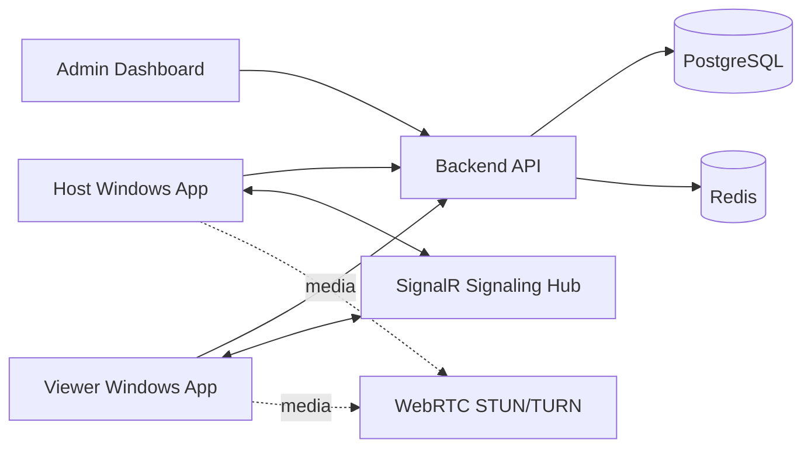

# Architecture

## System

## Session Lifecycle

1. Host logs in and registers a device.
2. Host generates a short-lived pairing code.
3. Viewer enters the code and requests a session.
4. Backend persists the request and signaling notifies the host.
5. Host user sees viewer identity and requested permissions.
6. Host approves or rejects. No approval means no session.
7. Approved sessions exchange WebRTC offer/answer/ICE through SignalR.
8. Host can end the session or downgrade permissions at any time.
9. Backend writes audit logs and session metrics.

## Layers

- Domain: entities, enums and business constants.
- Application: DTOs, use-case services and interfaces.
- Infrastructure: EF Core, token, password hashing and audit implementations.
- API: controllers, middleware, SignalR hub and host configuration.

## Media Strategy

MVP uses interfaces and mock streaming services. Production should plug in `Windows.Graphics.Capture`, hardware encoding and WebRTC video tracks. TURN is provided by Coturn for NAT traversal.
